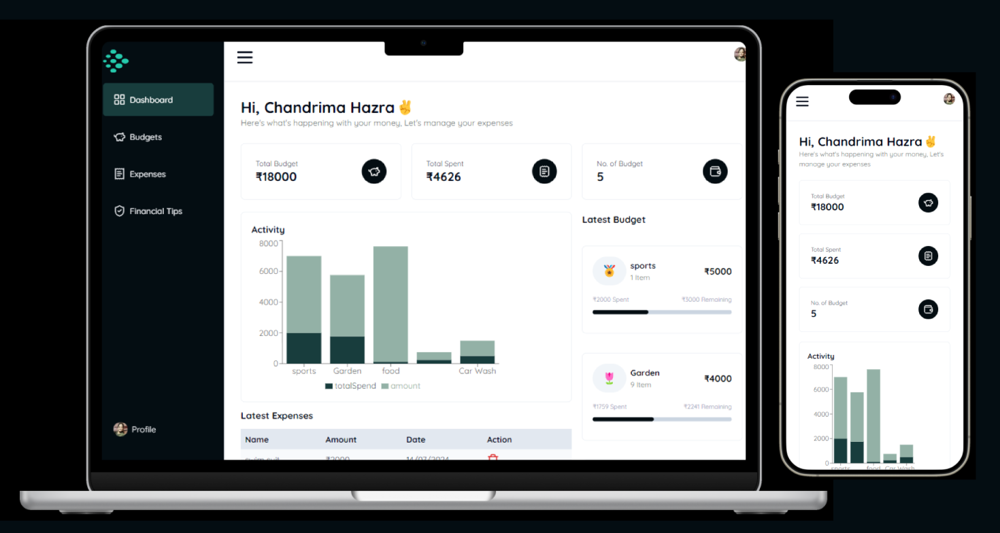

# Budget and Finance Tracker app
## Track expenses effortlessly, manage budgets, and achieve financial goals easily, with MoneyMaster.
### Live Site: [Money Master](https://budget-finance-tracker.vercel.app/)

A student-friendly financial management tool tailored to students' needs.

## Features :
- Personalised Budget Planners
- Expense Trackers with intuitive charts/graphs
- Financial Tips tailored specifically for Students

## 🛠️ Tech Stack
### Languages :
 &nbsp;  &nbsp;  &nbsp;

 

### Frameworks :
 &nbsp;  &nbsp;
 &nbsp;

 

### Database :

### ORM :

